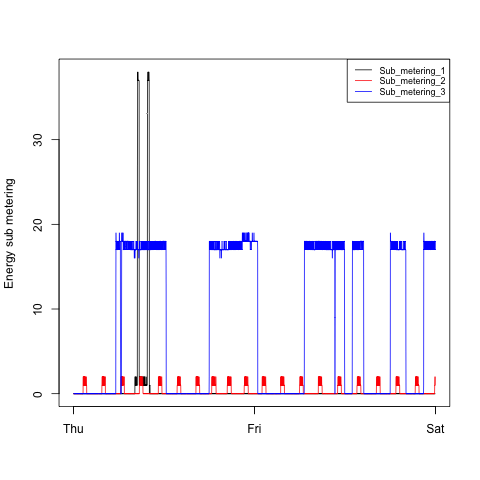
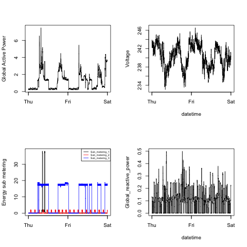

#README
Author: ***Liu Li***   
Github: <https://github.com/ll0816/ExData_Plotting1.git>

`Please clone this repo to your local machine to see the files or see the raw files on Github directly. This file performed badly on Github due to nested unordered lists.`
## Background

This code is for the project 1 of [Exploratory Data Analysis](https://class.coursera.org/exdata-002/).  
More details about the project can be found at the following GitHub repository: [https://github.com/rdpeng/ExData_Plotting1](https://github.com/rdpeng/ExData_Plotting1)  
Dataset: [Electric power consumption](https://d396qusza40orc.cloudfront.net/exdata%2Fdata%2Fhousehold_power_consumption.zip)


## Steps to Reproduce Project

#### Open your Terminal && Run Code

```
git clone https://github.com/ll0816/ExData_Plotting1.git
```

### Click link below to download the dataset and put it under the above cloned directory.
Dataset: [Electric power consumption](https://d396qusza40orc.cloudfront.net/exdata%2Fdata%2Fhousehold_power_consumption.zip)  

### Three ways of reproducing project 

1. ```
	cd "Path to this Directory"
	unzip household_power_consumption.zip
	```	
	**Keep your Rstudio open**, Set `wd` of Rstudio correctly and Run Code in Terminal  

	```
	R CMD BATCH Shortcut.R
	```

2. * Unzip `household_power_consumption.zip` 
   * Open `Shortcut.R` 
   * Set `wd` correctly (in Rstudio)
   * Run code.
    
3. * Unzip `household_power_consumption.zip`
   * Set `wd` correctly (in Rstudio)
   * Open `plot1.R/plot2.R/plot3.R/plot4.R` seperately and Run them.


**Outputs:** plot1.png, plot2.png, plot3.png, plot4.png

> PS: The size of reference plots given by teacher seems beyond the width of 480 pixels and height of 480 pixels, whereas **Instruction** of this project requires us to `construct the plot and save it to a PNG file with a width of 480 pixels and a height of 480 pixels`. Therefore, I comply with the latter requirement. 

## My Plot 1


## Reference Plot 1 from assignment
 


## My Plot 2


## Reference Plot 2 from assignment
 


## My Plot 3


## Reference Plot 3 from assignment
 


## My Plot 4


## Reference Plot 4 from assignment


*© All Rights reserved by **Liu Li** 13/10/2014 .*
